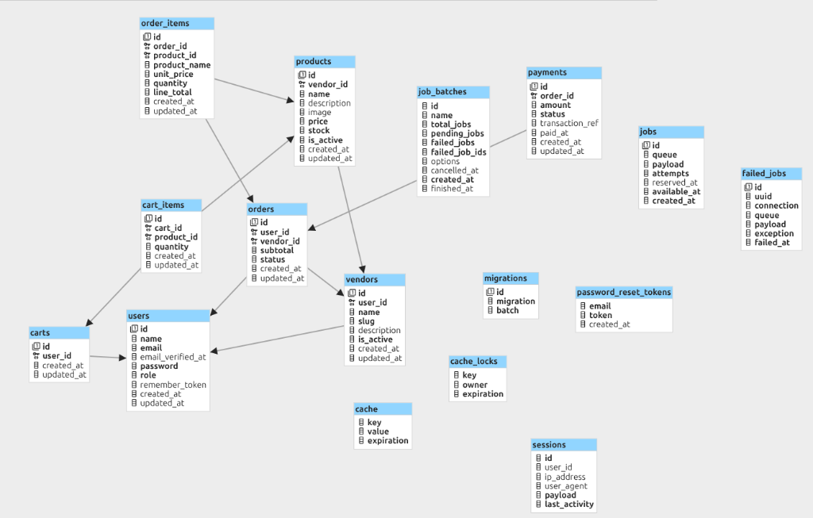
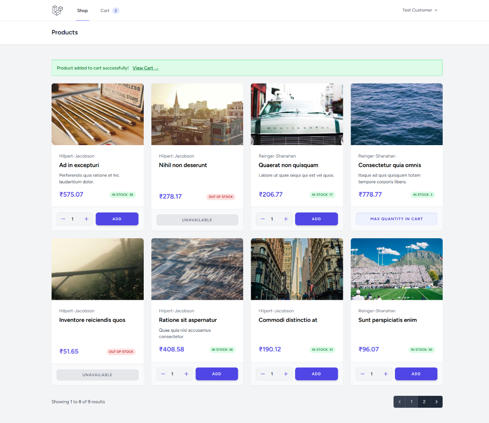
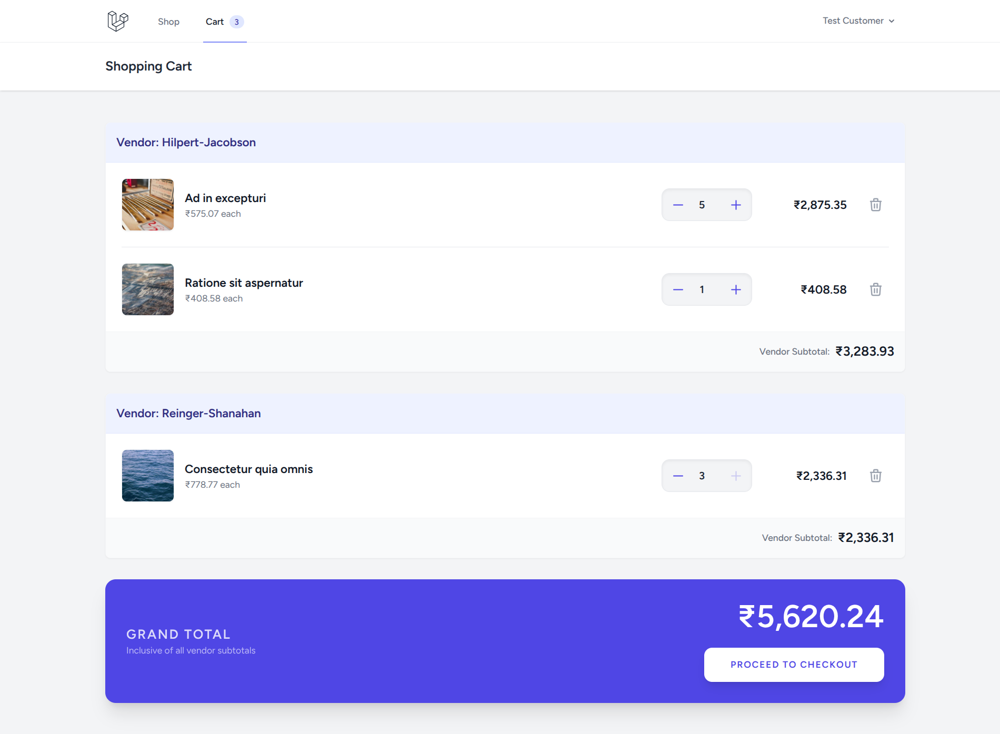
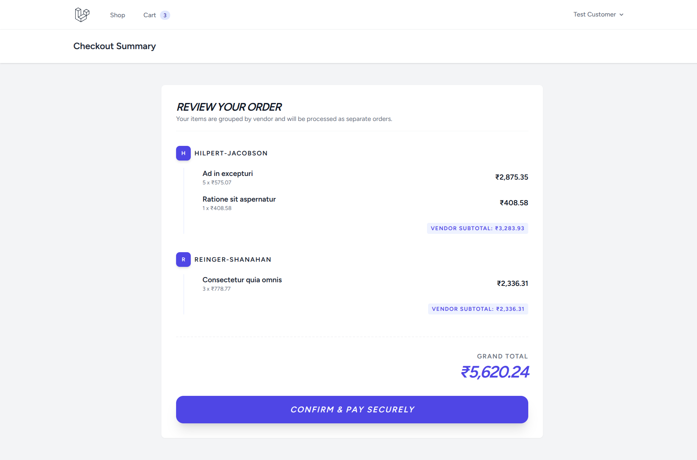
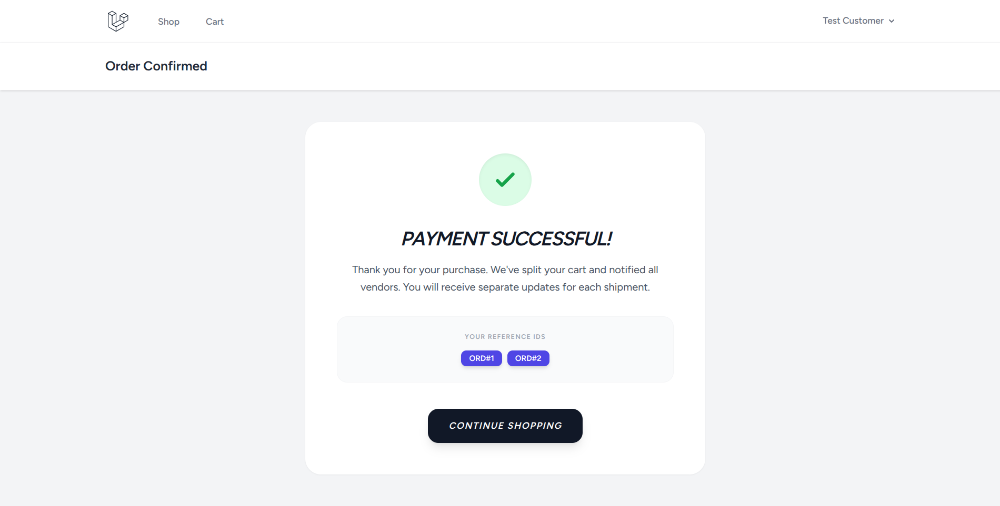
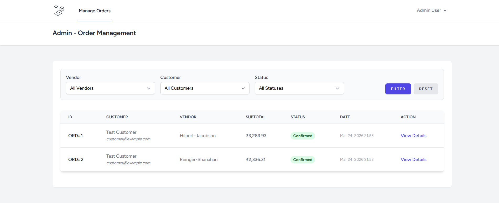
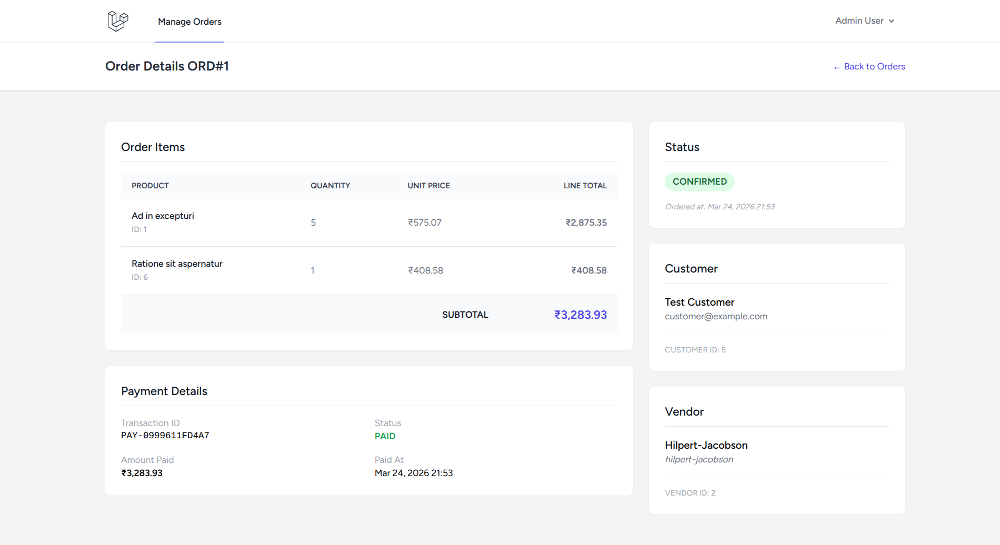

# Multi-Vendor Checkout & Order Engine

A production-grade, modular, and scalable multi-vendor e-commerce checkout system built with Laravel 12, following clean architecture principles. It supports background job processing and ensures inventory consistency through race condition protection. Customers can add products from multiple vendors to a single cart, and upon checkout, the system splits the cart into separate vendor-specific orders—simulating a real-world marketplace backend.

---

## Key Features

| Feature                             | Implementation                                                                                |
| ----------------------------------- | --------------------------------------------------------------------------------------------- |
| Multi-Vendor Cart & Checkout        | Items grouped by vendor, separate orders per vendor in one atomic transaction, stock tracking |
| Guest & Authenticated Carts         | Session-based cart for guests, DB cart for users, auto-merge on login                         |
| Inventory Race Condition Protection | Pessimistic locking via `lockForUpdate()` during checkout                                     |
| Event-Driven Notifications          | `OrderPlaced` / `PaymentSucceeded` events with queued listeners                               |
| Email Notifications                 | `OrderPlacedNotification` and `NewOrderVendorNotification` via mail                           |
| Auto-Cancel Unpaid Orders           | Scheduled hourly command `orders:cancel-unpaid` with stock restoration                        |
| Role-Based Access Control           | Admin, Vendor, Customer roles with Middleware + Policies                                      |
| Admin Dashboard                     | Filterable order management panel                                                             |
| Service Layer Architecture          | Business logic in `CartService`, `OrderService`, `ProductService`                             |
| Form Request Validation             | `AddToCartRequest`, `UpdateCartRequest` with real-time stock validation                       |

---

## Setup Instructions

### Prerequisites

- **PHP** >= 8.2
- **Composer** >= 2.x
- **Node.js** >= 18.x & **NPM**
- **MySql** or MariaDB/SQLite/PostgreSQL

### Quick Setup (One Command)

```bash
git clone git@github.com:RizwAnsari/multi-vendor-checkout-system.git
cd multi-vendor-checkout-system
composer run setup
```

The `composer run setup` command will automatically:

1. Install PHP dependencies(packages)
2. Copy `.env.example` → `.env`
3. Generate application key
4. Run all migrations
5. Install NPM dependencies
6. Build frontend assets

### Manual Setup

```bash
# 1. Install dependencies
composer install
npm install

# 2. Environment
cp .env.example .env
php artisan key:generate

# 3. Database (MySQL)
php artisan migrate

# 4. Seed sample data
php artisan db:seed

# 5. Build assets
npm run build
```

### Running the Application

```bash
# Option 1: All-in-one dev server (recommended)
composer run dev

# This starts concurrently:
#   - Laravel dev server (php artisan serve)
#   - Queue worker (php artisan queue:listen)
#   - Log watcher (php artisan pail)
#   - Vite dev server (npm run dev)
```

```bash
# Option 2: Manual (separate terminals)
php artisan serve              # Terminal 1: Web server
php artisan queue:work         # Terminal 2: Process queued notifications
php artisan schedule:work      # Terminal 3: Run scheduled auto-cancel command
```

---

## Sample Credentials

> All seeded users use password: **`password`**

| Role         | Email                  | Password   |
| ------------ | ---------------------- | ---------- |
| **Admin**    | `admin@example.com`    | `password` |
| **Customer** | `customer@example.com` | `password` |

Additionally, **3 vendor users** are auto-generated with random emails (check `users` table).

### Seeder Details (`DatabaseSeeder.php`)

| What     | Count | Notes                                 |
| -------- | ----- | ------------------------------------- |
| Vendors  | 3     | Each with a linked vendor-role user   |
| Products | 9     | Randomly distributed across 3 vendors |
| Admin    | 1     | `admin@example.com`                   |
| Customer | 1     | `customer@example.com`                |

---

## Schema Design



---

## Architecture Decisions

### 1. Service Layer Pattern

All business logic lives in dedicated **Service classes**, keeping controllers thin:

```
app/Services/
├── Admin/
│   └── OrderService.php        # Admin order filtering & detail loading
└── Customer/
    ├── CartService.php          # Cart CRUD, guest/user merge, stock validation
    ├── OrderService.php         # Multi-vendor checkout orchestration
    └── ProductService.php       # Product listing & stock checks
```

**Why?** Controllers only handle HTTP concerns (request/response). Services are reusable across web routes, API routes, artisan commands, and tests.

### 2. Modular Route Organization

Routes are split into domain-specific files loaded via `bootstrap/app.php`:

```
routes/
├── web.php         # Base auth routes
├── product.php     # Public product browsing (/ → products.index)
├── cart.php        # Cart CRUD (Policy-gated via CartPolicy)
├── checkout.php    # Checkout flow (auth + policy required)
├── admin.php       # Admin panel (auth + AdminMiddleware)
├── auth.php        # Breeze auth scaffolding
└── console.php     # Scheduled commands
```

### 3. Inventory Race Condition Protection

The `OrderService::processOrderItem()` uses **pessimistic locking** within a DB transaction:

```php
$product = Product::active()->lockForUpdate()->find($item->product->id);
```

This locks the product row at the database level until the transaction commits, preventing two concurrent checkouts from overselling the last item. Combined with `decrement('stock', $quantity)` for atomic deduction.

### 4. Event-Driven Architecture (Open-Closed Principle)

Side-effects are decoupled from core checkout logic using Events & Listeners:

```
OrderPlaced Event
  ├── SendOrderConfirmation (→ OrderPlacedNotification to customer)
  └── NotifyVendorOfNewOrder (→ NewOrderVendorNotification to vendor)

PaymentSucceeded Event
  └── GenerateOrderInvoice (logs invoice generation)
```

All listeners implement `ShouldQueue` — notifications are processed in the background without blocking the checkout response.

### 5. Guest-to-User Cart Merge

The `MergeCartOnLogin` listener hooks into Laravel's `Illuminate\Auth\Events\Login` event. When a guest adds items to their session cart and then logs in, items are merged into their database cart (capping at available stock).

### 6. Authorization Strategy

- **CartPolicy**: Controls who can manage cart operations (guests allowed, authenticated must be customers)
- **AdminMiddleware**: Restricts `/admin/*` routes to users with `UserRole::ADMIN`
- **Form Requests**: `AddToCartRequest` validates stock availability accounting for items already in cart

### 7. Scheduled Maintenance

The `orders:cancel-unpaid` command (hourly via `Schedule::command()`) automatically:

1. Finds orders in `PENDING` status older than the configured timeout (default: 24 hours)
2. Restores product stock for each order item
3. Marks orders as `CANCELLED`

Timeout is configurable via `config('shop.unpaid_order_timeout')`.

---

## Trade-offs & Assumptions

| Decision                        | Trade-off                       | Rationale                                                                                                                                                                                                                                                                                            |
| ------------------------------- | ------------------------------- | ---------------------------------------------------------------------------------------------------------------------------------------------------------------------------------------------------------------------------------------------------------------------------------------------------- |
| **Simulated Payments**          | No real payment gateway         | Payments are marked as `PAID` immediately. In production, this would be handled by a Stripe/Razorpay webhook updating status asynchronously.                                                                                                                                                         |
| **Unified Transaction**         | All-or-nothing checkout         | If stock runs out for one vendor's product, the entire multi-vendor checkout rolls back. This prioritizes data consistency over partial fulfillment.                                                                                                                                                 |
| **Session-Based Auth (Breeze)** | No API token auth               | The app uses Blade templates with session-based authentication. Laravel Sanctum is installed to support future API expansion, though it is not currently in active use. This allows a smooth transition to a React, Vue, mobile, or API-driven architecture using the same reusable service classes. |
| **Log Mailer**                  | No real emails sent             | `MAIL_MAILER=log` writes email content to `storage/logs/laravel.log`. Switch to `smtp`/`mailgun` for production.                                                                                                                                                                                     |
| **Database Queue**              | Simpler setup, lower throughput | Uses `QUEUE_CONNECTION=database`. For production, switch to Redis for better performance.                                                                                                                                                                                                            |
| **No Rate Limiting**            | API/route abuse possible        | Rate limiting is not implemented in this version. In a production app, Laravel's `throttle` middleware should be applied to login, registration, checkout, and cart routes to prevent abuse.                                                                                                         |
| **Error Handling**              | Medium coverage                 | Custom exceptions (`EmptyCartException`, `InsufficientStockException`) and a global `_log_exception` helper are in place. A real-world app would need more robust error handling, standardized API error responses, and granular try/catch blocks.                                                   |
| **No Test Cases**               | Planned                         | Test cases are not included for simplicity and time constraints. In a production application, feature tests for checkout flow, cart operations, admin filtering, and unit tests for services would be essential.                                                                                     |
| **No Vendor Dashboard**         | Limited vendor experience       | A vendor dashboard for product and order management is not included for simplicity. In a full marketplace, vendors would need their own panel to manage inventory, view orders, and track payments.                                                                                                  |
| **Limited Database Indexing**   | Slower queries at scale         | Database indexing is minimal. In a real-world application, indexes would be added based on actual query patterns (e.g., composite indexes on `orders` for vendor+status filtering).                                                                                                                  |
| **No Column Selection**         | Higher memory usage             | Currently all table columns are selected in queries (`SELECT *`). In production, specific column selection (`select()`) should be used to reduce memory footprint and improve query performance.                                                                                                     |
| **N+1 Query Optimization**      | Partial coverage                | Eager loading (`with()`) is applied on major places like product listing, cart display, and admin order views. However, some places like listeners (`SendOrderConfirmation`, `NotifyVendorOfNewOrder`) and the `CancelUnpaidOrders` command still access relationships without eager loading.        |

---

## Project Structure

```
app/
├── Console/Commands/        # Artisan commands (CancelUnpaidOrders)
├── Enums/                   # UserRole, OrderStatus, PaymentStatus
├── Events/                  # OrderPlaced, PaymentSucceeded
├── Exceptions/              # EmptyCartException, InsufficientStockException
├── Helpers/                 # Global helper (_log_exception)
├── Http/
│   ├── Controllers/
│   │   ├── Admin/           # Order management
│   │   ├── Auth/            # Breeze authentication
│   │   └── Customer/        # Cart, Checkout, Product
│   ├── Middleware/           # AdminMiddleware
│   └── Requests/            # AddToCartRequest, UpdateCartRequest
├── Listeners/               # SendOrderConfirmation, NotifyVendorOfNewOrder, etc.
├── Models/
│   ├── Customer/            # Cart, CartItem, Order, OrderItem, Payment
│   ├── Product.php
│   ├── User.php
│   └── Vendor.php
├── Notifications/           # OrderPlacedNotification, NewOrderVendorNotification
├── Policies/                # CartPolicy
├── Providers/               # AppServiceProvider
├── Services/
│   ├── Admin/               # OrderService (admin)
│   └── Customer/            # CartService, OrderService, ProductService
└── View/Components/         # AppLayout

routes/
├── web.php              # Base web routes
├── product.php          # Product browsing (public)
├── cart.php             # Cart CRUD (policy-gated)
├── checkout.php         # Checkout flow (auth + policy)
├── admin.php            # Admin panel (auth + admin middleware)
├── auth.php             # Breeze authentication
└── console.php          # Scheduled commands
```

---

## Screenshots

### Product Listing Page



### Cart Page



### Checkout Page



### Success Page



### Admin Orders List Page



### Admin Order Details Page


